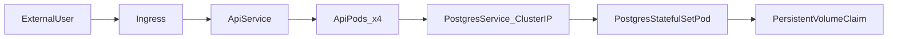

# Two-tier Kubernetes deployment (ASP.NET Core API + Postgres)

## Repository & Images

- **Code repository**: [https://github.com/KumVivek/kubernetes-assignment](https://github.com/KumVivek/kubernetes-assignment)
- **Docker Hub image**: [https://hub.docker.com/r/napgsi/nagp-vivek](https://hub.docker.com/r/napgsi/nagp-vivek)
- **Image tags**: `napgsi/nagp-vivek:v1.1` (initial), `napgsi/nagp-vivek:v2.1` (final / rolling update demo)

## Service URL

- **Ingress host**: `api.local` (mapped via Windows hosts file)
- **Ingress external IP**: `20.204.206.79`
- **Endpoint**: [http://api.local/records](http://api.local/records)
- **Screen recording**: https://drive.google.com/file/d/1V42Nta8jLdRn6P7n5rNopSADxObGkJWf/view?usp=sharing

## Requirement Understanding

This project delivers a two-tier Kubernetes application:

- **API tier** (4 replicas) exposed externally via **Ingress**, with **rolling updates**, **self-healing** (probes + pod recreation), and **HPA**.
- **DB tier** (Postgres, 1 pod) internal-only via **ClusterIP**, seeded with **7 records**, **persistent storage** (PVC), and self-healing.
- **ConfigMap** for DB connection settings (host, port, name, user) outside application code.
- **Secret** for DB password (not stored in plaintext in committed YAML).
- **FinOps**: CPU/memory requests and limits, observed metrics, and cost optimization opportunities.

## Assumptions

- **AKS** cluster with `kubectl` access (Dev/Test preset).
- **NGINX Ingress Controller** installed in `ingress-nginx` namespace.
- **metrics-server** enabled for HPA and `kubectl top`.
- Default **StorageClass** for dynamic PVC provisioning (Azure Disk).
- **Hosts file** maps `api.local` → ingress public IP (no real DNS).
- Secrets are created at deploy time via `kubectl create secret` (not committed with real values).
- Azure Load Balancer health probe configured for ingress-nginx `/healthz` endpoint.

## Solution Overview

### Repository structure

- `src/Api/` — HTTP endpoints + DI (presentation layer)
- `src/Application/` — use cases + repository abstractions
- `src/Domain/` — core entities
- `src/Infrastructure/` — Npgsql/Postgres implementation
- `k8s/` — Kubernetes manifests
- `KubernetesAssignment.sln` — solution file (projects + k8s manifests)

### API (Clean Architecture)

- `**Domain`**: entity `Record`
- `**Application**`: `GetRecordsHandler`, `IRecordsRepository`
- `**Infrastructure**`: `NpgsqlRecordsRepository`, env-based DB options, DI extension
- `**Api**`: minimal API endpoints only

**Endpoints:**


| Endpoint            | Purpose                                                   |
| ------------------- | --------------------------------------------------------- |
| `GET /records`      | Returns JSON records from Postgres                        |
| `GET /health/live`  | Liveness probe                                            |
| `GET /health/ready` | Readiness probe (DB connectivity check)                   |
| `GET /`             | Root health (returns 200 for load balancer compatibility) |


### Database

- Postgres 16 **StatefulSet** with PVC (`2Gi`)
- Init SQL via ConfigMap (`postgres-init-sql`) seeds 7 records
- Internal **ClusterIP** service `postgres` (not exposed externally)




## Configuration

### API environment variables


| Variable                                   | Source                 | Description                                       |
| ------------------------------------------ | ---------------------- | ------------------------------------------------- |
| `DB_HOST`, `DB_PORT`, `DB_NAME`, `DB_USER` | ConfigMap `api-config` | Postgres connection (service DNS, no pod IPs)     |
| `DB_PASSWORD`                              | Secret `api-secret`    | Database password                                 |
| `APP_VERSION`                              | ConfigMap `api-config` | Shown in `/records` response (v1/v2 rollout demo) |


### Secrets (deploy-time, not committed)

```powershell
kubectl create secret generic api-secret --from-literal=DB_PASSWORD="<password>"
kubectl create secret generic postgres-secret --from-literal=POSTGRES_PASSWORD="<password>"
```

## Deploy

### Prerequisites

1. AKS cluster + `kubectl` configured
2. NGINX Ingress installed
3. Annotate ingress service for Azure LB health probe:
  ```powershell
   kubectl annotate svc ingress-nginx-controller -n ingress-nginx `
     service.beta.kubernetes.io/azure-load-balancer-health-probe-request-path=/healthz --overwrite
  ```
4. Add to `C:\Windows\System32\drivers\etc\hosts`:
  ```
   20.204.206.79 api.local
  ```

### Apply manifests

```powershell
# Create secrets first (do not apply placeholder secret YAMLs)
kubectl create secret generic api-secret --from-literal=DB_PASSWORD="<password>"
kubectl create secret generic postgres-secret --from-literal=POSTGRES_PASSWORD="<password>"

# Apply all other manifests (exclude api-secret.yaml and db-secret.yaml)
kubectl apply -f k8s/db-configmap.yaml
kubectl apply -f k8s/db-configmap-init.sql.yaml
kubectl apply -f k8s/db-service.yaml
kubectl apply -f k8s/db-statefulset.yaml
kubectl apply -f k8s/api-configmap.yaml
kubectl apply -f k8s/api-deployment.yaml
kubectl apply -f k8s/api-service.yaml
kubectl apply -f k8s/api-ingress.yaml
kubectl apply -f k8s/api-hpa.yaml
kubectl apply -f k8s/loadgen/loadgen-deployment.yaml
```

### Verify

```powershell
kubectl get pods
Invoke-WebRequest http://api.local/records -Proxy $null | Select-Object -Expand Content
```

## Justification for the Resources Utilized

### Initial resource settings


| Component | CPU request            | CPU limit      | Memory request | Memory limit |
| --------- | ---------------------- | -------------- | -------------- | ------------ |
| API (×4)  | 100m                   | 500m           | 128Mi          | 512Mi        |
| Postgres  | 50m                    | 250m           | 128Mi          | 512Mi        |
| HPA       | min 4, max 10 replicas | CPU target 50% |                |              |


### Observed metrics (`kubectl top pods`)

**API pods (4 replicas, image v2.1):**


| Pod         | CPU | Memory |
| ----------- | --- | ------ |
| api-*-cbvmr | 41m | 77Mi   |
| api-*-l4np7 | 43m | 77Mi   |
| api-*-pbs6c | 45m | 78Mi   |
| api-*-xwb4g | 49m | 78Mi   |


**Postgres:**


| Pod        | CPU | Memory |
| ---------- | --- | ------ |
| postgres-0 | 28m | 27Mi   |


### Right-sizing analysis

- **API**: Observed ~41–49m CPU and ~77–78Mi memory vs requests of 100m/128Mi. Utilization is ~40–50% of CPU request and ~60% of memory request under loadgen. Requests are conservative but acceptable for headroom during HPA scale-up.
- **Postgres**: Observed 28m CPU and 27Mi memory vs requests of 50m/128Mi. Significantly underutilized — could reduce to `requests: 50m/64Mi` in non-prod to save cluster capacity.
- **HPA**: Min 4 replicas matches assignment requirement; scales up under loadgen to avoid over-provisioning idle capacity.

## Cost Optimization Opportunities (≥3)

1. **Right-size API requests/limits** — Observed usage (~45m CPU, ~77Mi RAM) is below requests (100m/128Mi). In non-prod, reduce requests to ~50m/64Mi to improve node packing and reduce wasted allocatable capacity.
2. **HPA + load-based scaling** — HPA (min 4, max 10, CPU 50%) scales API pods only under load. Combined with AKS cluster autoscaler, nodes scale only when needed.
3. **Multi-stage Docker image** — `napgsi/nagp-vivek:v2.1` compressed size ~87 MB (vs full SDK image). Smaller images reduce pull time, registry storage, and node disk usage.
4. **Postgres PVC sizing** — PVC is 2Gi; observed DB footprint is small (~27Mi RAM). Avoid oversized disks in non-prod; use appropriate StorageClass tier.
5. **Teardown after submission** — Delete AKS cluster after screen recording to avoid ongoing compute and LB costs.

## Screen Recording Checklist

- [ ] Show all objects:
  ```powershell
  kubectl get ns,deploy,rs,pods,svc,ingress,hpa,statefulset,pvc,cm,secret
  ```
- [ ] API call retrieving records:
  ```powershell
  Invoke-WebRequest http://api.local/records -Proxy $null | Select-Object -Expand Content
  ```
- [ ] Self-healing — delete API pod, show recreation:
  ```powershell
  kubectl delete pod <api-pod-name>
  kubectl get pods -l app=api -w
  ```
- [ ] Self-healing — delete DB pod, show recreation:
  ```powershell
  kubectl delete pod postgres-0
  kubectl get pods -l app=postgres -w
  ```
- [ ] Persistence — same records after DB restart + PVC bound:
  ```powershell
  Invoke-WebRequest http://api.local/records -Proxy $null | Select-Object -Expand Content
  kubectl get pvc
  ```
- [ ] Rolling update v1.1 → v2.1:
  ```powershell
  kubectl set image deploy/api api=napgsi/nagp-vivek:v2.1
  kubectl rollout status deploy/api
  Invoke-WebRequest http://api.local/records -Proxy $null | Select-Object -Expand Content
  ```
- [ ] HPA scaling under load:
  ```powershell
  kubectl get hpa -w
  kubectl get pods -l app=api -w
  ```
- [ ] FinOps evidence:
  ```powershell
  kubectl top pods -l app=api
  kubectl top pods postgres-0
  ```

